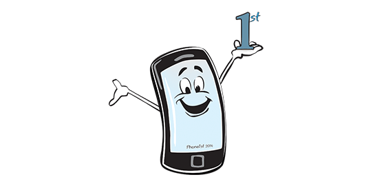

# Welcome to Phone1st
#### A light, clean, starter theme that starts _phone first_

>A light and basic html starter theme to get you off to a quick start with your web developments. The CSS is put together using SCSS, a popular way of creating quick, organised stylesheets. Using Phone1st will save you time, building quicker, smarter projects. Once you start using Phone1st you'll keep using it.

All startup files are in place ready for building your site. You can view the theme [here](https://phone1st-theme.netlify.com/)

### Phone1st Documents
This site promotes the Phone1st Starter theme for html. As well as promoting the Phone1st Theme the articles on this site promote web development and web design in general.

### Contact Info:   
email [h@bylucas.co.uk](mailto:h@bylucas.co.uk)  
View the theme [here](https://phone1st-theme.netlify.com/)
Download the theme [here](https://github.com/bylucas/phone1st-theme)

